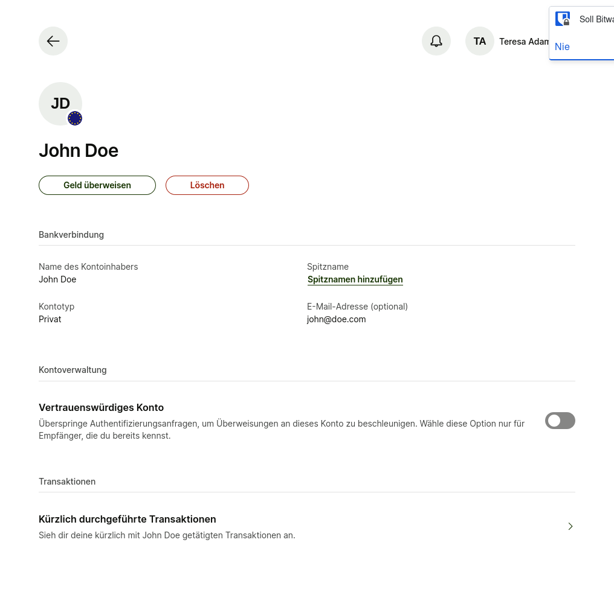
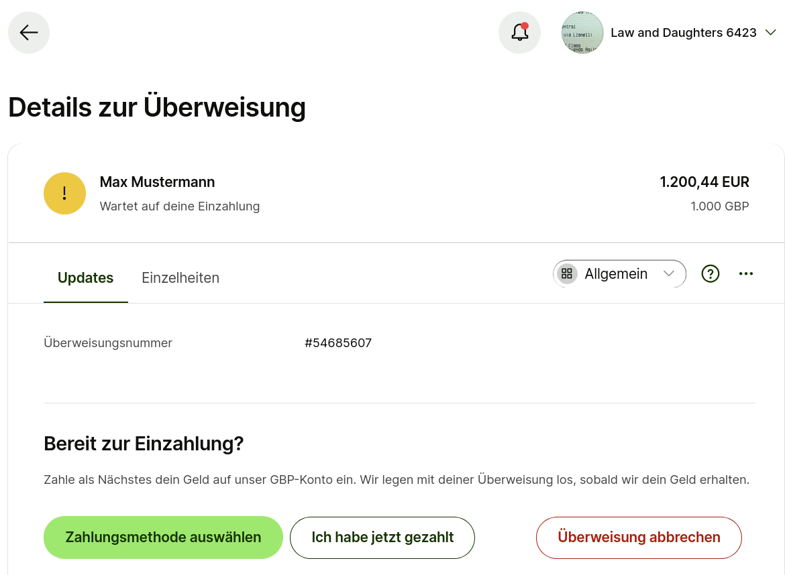

# wise-banking-api-client

An unofficial Python client library for the [Wise API](https://docs.wise.com/api-docs/api-reference).

The classes, functions and interfaces that this library provides are very much in-development and prone to change.
This is a fork of [pywisetransfer]

[pywisetransfer]: https://github.com/jayaddison/pywisetransfer

## Installation

```bash
pip install wise-banking-api-client
```

## Command Line

You can use some of the functions on the command line.
By installing `wise_banking_api_client`, you also install the `wise` command.

### Help and Information

Get help:

```bash
wise --help
```

### Generate a Key Pair

We can generate a key pair.
Note that this needs the `openssl` command installed.

```sh
$ wise new-key
writing RSA key
private key: wise.com.private.pem
public key: wise.com.public.pem
You can now upload the public key to https://wise.com or https://sandbox.transferwise.tech.
```

### Check API Key

You can check if your API key and private key work.

```sh
$ WISE_API_KEY="your api key" python -m wise_banking_api_client check
Permissions on sandbox: read+write+sca
Permissions on live: none
```

## Python Package

After installation, you should be able to import the package.

```python
>>> from wise_banking_api_client import Client

```

Wise provides [two APIs](https://docs.wise.com/api-docs/api-reference#environments): `live` and `sandbox`.
You can use either of these environments with this library.

### API Key

In order to use the API, you need to obtain an API key.
This key looks like this: `12345678-1234-1234-1234-123456789abcde`

To use the sandbox API, log into [sandbox.transferwise.tech].
Then, go to Settings 🠚 Developer Tools 🠚 API-Tokens.
Create and copy a new API key.

To use your own account, log into [wise.com](https://wise.com).
Then click on your account at the top right 🠚 Integrations and Tools 🠚 Developer Tools 🠚 API Tokens and add a new token.

[sandbox.transferwise.tech]: https://sandbox.transferwise.tech

### API Requests

The API requests are made using the [requests](https://requests.readthedocs.io/en/latest/) library.
First of all, you create a `Client` object:

- Create a `Client` object with your API key for the `live` environment:

    ```python
    >>> client = Client(api_key="your-api-key-here", environment="live")

    ```

- Create a `Client` object with your API key for the `sandbox` environment:

    ```python
    >>> client = Client(api_key="your-api-key-here")

    ```

- Create a `Client` object which interacts with the recorded API which is used for the tests:

    ```python
    >>> from wise_banking_api_client.test import TestClient
    >>> client = TestClient()

    ```

    After this, all calls to the real Wise API are blocked by the `responses` library.
    To stop using the recorded API:

    ```python
    client.stop()
    ```

## Examples

This section provides a few examples of how to use this package.

### Profiles

This library follows the **[Wise API Reference]**.
So, if you find e.g. profile here, you can look up all the values of it in the [Wise API Reference].

If you create a sandbox account, you should have two profiles: `business` and `personal`.

```python
>>> for profile in client.profiles.list():
...     print(f"id: {profile.id}")
...     print(f"type: {profile.type}")
...     print(f"name: {profile.details.name}")
... 
id: 28577318
type: personal
name: Teresa Adams
id: 28577319
type: business
name: Law and Daughters 6423

```

### Receive Money

One profile can have several accounts in different currencies.
This shows which currencies are accepted and how to receive money.

```python
>>> for profile in client.profiles.list():
...     accounts = client.account_details.list(profile_id=profile.id)
...     print(f"type: {profile.type}")
...     for account in accounts:
...         print(
...             f"    currency: {account.currency.code}"
...             f" receive with: {', '.join(feature.title for feature in account.bankFeatures if feature.supported)}")
... 
type: personal
    currency: EUR receive with: Receive locally, Receive internationally (Swift), Set up Direct Debits, Receive from PayPal and Stripe
    currency: GBP receive with: Receive locally, Receive internationally (Swift), Set up Direct Debits, Receive from PayPal and Stripe
    currency: USD receive with: Receive locally, Receive internationally (Swift), Set up Direct Debits, Receive from PayPal and Stripe
    currency: AUD receive with: Receive locally, Set up Direct Debits
    currency: NZD receive with: Receive locally
    currency: CAD receive with: Receive locally, Set up Direct Debits
    currency: HUF receive with: Receive locally
    currency: MYR receive with:
    currency: RON receive with: Receive locally
    currency: SGD receive with: Receive locally
    currency: TRY receive with: Receive locally
type: business
    currency: EUR receive with: Receive locally, Receive internationally (Swift), Set up Direct Debits, Receive from PayPal and Stripe
    currency: GBP receive with: Receive locally, Receive internationally (Swift), Set up Direct Debits, Receive from PayPal and Stripe
    currency: USD receive with: Receive locally, Receive internationally (Swift), Set up Direct Debits, Receive from PayPal and Stripe
    currency: AUD receive with: Receive locally, Set up Direct Debits
    currency: NZD receive with: Receive locally
    currency: CAD receive with: Receive locally, Set up Direct Debits
    currency: HUF receive with: Receive locally
    currency: MYR receive with:
    currency: RON receive with: Receive locally
    currency: SGD receive with: Receive locally
    currency: TRY receive with: Receive locally

```

[Wise API Reference]: https://docs.wise.com/api-docs/api-reference

### Balance

This code retrieves the balance for each currency in each account.

```python
>>> profiles = client.profiles.list()
>>> for profile in profiles:
...     print(f"type: {profile.type} {', '.join(f'{balance.totalWorth.value}{balance.totalWorth.currency}' for balance in client.balances.list(profile=profile))}")
... 
type: personal 1000000.0GBP, 1000000.0EUR, 1000000.0USD, 1000000.0AUD
type: business 1000000.0GBP, 1000000.0EUR, 1000000.0USD, 1000000.0AUD

```

### Currencies

Wise supports many [currencies](https://docs.wise.com/api-docs/api-reference/currencies).

```python
>>> currencies = client.currencies.list()
>>> AED = currencies[0]
>>> AED.code
'AED'
>>> AED.name
'United Arab Emirates dirham'
>>> AED.symbol
'د.إ'

```

Above are the up-to-date currencies.
You can also use those in the package.

```python
>>> from wise_banking_api_client import Currency
>>> Currency.AED.code
'AED'
>>> Currency.AED.name
'United Arab Emirates dirham'
>>> Currency.AED.symbol
'د.إ'

```

### Recipient Account Requirements

In this example, we get the requirements for a recipient account that should receive 100 GBP from us.

```python
>>> requirements = client.recipient_accounts.get_requirements_for_currency(source=Currency.GBP, target=Currency.GBP, source_amount=100)
>>> list(sorted([requirement.type for requirement in requirements]))
['email', 'iban', 'sort_code']

```

Genrally, for thie currency, we can send money to a recipient specified by email, IBAN or sort code.

### Webhook signature verification

```python
from flask import abort, request
from wise_banking_api_client.webhooks import validate_request

@app.route("/payments/wise/webhooks")
def handle_wise_webhook():
    try:
        validate_request(request)
    except Exception as e:
        logger.error(f"Wise webhook request validation failed: {e}")
        abort(400)

    ...
```

### Request an Example Quote

You can request quote examples as stated in [Create an un-authenticated quote](https://docs.wise.com/api-docs/api-reference/quote#create-not-authenticated).

In this example, we want to transfer `GBP` to `USD` and make sure we have `110USD` in the end.
The example quote requires less information than a real quote.

```python
>>> from wise_banking_api_client import ExampleQuoteRequest
>>> quote_request = ExampleQuoteRequest(
...     sourceCurrency="GBP",
...     targetCurrency="USD",
...     sourceAmount=None,
...     targetAmount=110,
... )
>>> example_quote = client.quotes.example(quote_request)
>>> example_quote.rate
1.25155
>>> example_quote.rateExpirationTime
datetime.datetime(2024, 12, 31, 19, 21, 44, tzinfo=datetime.timezone.utc)
>>> example_quote.profile == None  # Example quotes are not bound to a profile
True
>>> example_quote.rateType
'FIXED'

```

### Request a Quote

To create a transfer, you first need a quote.
You can read on how to create [Create an authenticated quote](https://docs.wise.com/api-docs/api-reference/quote#create-authenticated).

In this example, we create a quote for the personal account. This is the same quote as the one above.
We also provide pay-out and pay-in information.
The `targetAccount` is None because we don't know the recipient yet.

```python
>>> from wise_banking_api_client import QuoteRequest, PaymentMethod
>>> quote_request = QuoteRequest(
...        sourceCurrency="EUR",
...        targetCurrency="EUR",
...        sourceAmount=None,
...        targetAmount=1,
...        targetAccount=None,
...        payOut=PaymentMethod.BANK_TRANSFER,
...        preferredPayIn=PaymentMethod.BANK_TRANSFER,
...    )
>>> quote = client.quotes.create(quote_request, profile=profiles.personal[0])
>>> quote.user
12970746
>>> quote.status
'PENDING'
>>> quote.sourceCurrency
'GBP'
>>> quote.targetCurrency 
'USD'
>>> quote.sourceAmount is None  # the source amount depends on the payment option
True
>>> quote.targetAmount
110.0
>>> quote.rate
1.24232
>>> quote.rateType
'FIXED'
>>> quote.payOut
'BANK_TRANSFER'
>>> len(quote.paymentOptions)  # we have many payment options
20

```

### Get Recipient Requirements

The quote above lacks the recipient information.
The reason is that there are requirements to the recipient account that
depend on the quote.
We can get these requirements using `get_requirements_for_quote`.

```python
>>> requirements = client.recipient_accounts.get_requirements_for_quote(quote)
>>> [requirement.type for requirement in requirements]
['aba', 'fedwire_local', 'swift_code', 'email']

```

In the example above, we see different requirements for transferring money to a bank account
in the USA. We can use `aba`, `fedwire_local`, `swift_code` and `email`.

If we look at the first requirement, we see that we require 10 fields.

```python
>>> ach = requirements[0]
>>> ach.title
'ACH'
>>> len(requirements[0].fields)
10
>>> ach.fields[0].name
'Recipient type'
>>> ach.fields[0].group[0].required
True
>>> ach.fields[0].group[0].type  # the fields are grouped and this is a select with values
'select'
>>> [v.key for v in ach.fields[0].group[0].valuesAllowed]  # the JSON value for the details
['PRIVATE', 'BUSINESS']
>>> [v.name for v in ach.fields[0].group[0].valuesAllowed]  # what to show to the user
['Person', 'Business']

```

### Create an Email Recipient

> Wise: Please contact us before attempting to use email recipients. We do not recommend using this feature except for certain uses cases.

Because `email` is in the requirements, we can create an email recipient for the quote.

```python
>>> email = requirements[-1]
>>> len(email.required_fields)
2
>>> email.required_fields[0].group[0].key
'email'
>>> email.required_fields[0].group[0].name
'Email (Optional)'
>>> email.required_fields[1].group[0].key
'accountHolderName'
>>> email.required_fields[1].group[0].name
'Full name of the account holder'

```

Below, we create the recipient and get a response.
The response includes all the data that we sent and optional fields.

```python
>>> from wise_banking_api_client import Recipient, RecipientDetails, CurrencyCode, AccountRequirementType
>>> email_recipient = Recipient(
...     currency=CurrencyCode.EUR,
...     type=AccountRequirementType.email,
...     profile=profiles.personal[0].id,
...     accountHolderName="John Doe",
...     ownedByCustomer=False,
...     details=RecipientDetails(email="john@doe.com")
... )
>>> created_response = client.recipient_accounts.create_recipient(email_recipient)
>>> created_response.id  # the response has an id
700614969

```

In the following, we get the actual recipient account as the user sees it e.g. in the app.

```python
>>> recipient = client.recipient_accounts.get(created_response)
>>> recipient.id
700614969
>>> recipient.accountSummary
'john@doe.com'
>>> recipient.currency
'EUR'
>>> recipient.email
'john@doe.com'
>>> recipient.legalEntityType
'PERSON'
>>> recipient.ownedByCustomer
False

```



### Create an IBAN recipient

Email is discouraged. We can do better!
Belows we go through the flow of creating an IBAN recipient and updating the quote.

We use the business profile for this.

```python
>>> business_profile = profiles.business[0]

```

1. Create an EUR/IBAN quote. We transfer 1000 GBP to EUR.

    ```python
    >>> quote_request = QuoteRequest(sourceCurrency="GBP",targetCurrency="EUR", sourceAmount=1000)
    >>> quote = client.quotes.create(quote_request, business_profile)
    >>> quote.id
    'f8301dde-cdb4-46c0-b944-3a07c7807d47'

    ```

2. Get the recipient requirements for the quote.

    ```python
    >>> requirements = client.recipient_accounts.get_requirements_for_quote(quote)
    >>> requirements.iban.required_keys
    ['IBAN', 'accountHolderName', 'legalType']

    ```

3. Create an IBAN recipient.

    ```python
    >>> from wise_banking_api_client import Recipient, RecipientDetails, CurrencyCode, AccountRequirementType, LegalType
    >>> iban_recipient = Recipient(
    ...     currency=CurrencyCode.EUR,
    ...     type=AccountRequirementType.iban,
    ...     profile=business_profile.id,
    ...     accountHolderName="Max Mustermann",
    ...     ownedByCustomer=False,
    ...     details=RecipientDetails(
    ...         legalType=LegalType.PRIVATE,
    ...         IBAN="DE75512108001245126199"
    ...     )
    ... )
    >>> created_iban_recipient = client.recipient_accounts.create_recipient(iban_recipient)
    >>> created_iban_recipient.id
    700615308

    ```

4. Update the quote so that it works with the IBAN recipient.

    ```python
    >>> quote = client.quotes.update(created_iban_recipient, quote)
    >>> quote.status
    'PENDING'

    ```

5. Check the requirements again.

    The fields tell you if you need to check the requirements again.
    For example, the recipient type changes the required fields.

    ```python
    >>> requirements = client.recipient_accounts.get_requirements_for_quote(quote)
    >>> requirements.iban.required_keys
    ['IBAN', 'accountHolderName', 'legalType']

    ```

Above, we saw the flow of creating an IBAN recipient tied to the quote.

### Check the Prices

A Quote includes different pricing options.
These depend on the `payIn` and `payOut` options of the quote or the transfer.

Below, we show all the available options to pay for the transfer, sorted by price.

```python
>>> for po in sorted(quote.enabled_payments, key=lambda po: po.fee.total):
...     print(f"fee: {po.fee.total: <6} payIn: {po.payIn: <21} payOut: {po.payOut}")
fee: 3.69   payIn: BALANCE               payOut: BANK_TRANSFER
fee: 3.88   payIn: BANK_TRANSFER         payOut: BANK_TRANSFER
fee: 3.88   payIn: PISP                  payOut: BANK_TRANSFER
fee: 3.88   payIn: SWIFT                 payOut: BANK_TRANSFER
fee: 7.56   payIn: VISA_DEBIT_OR_PREPAID payOut: BANK_TRANSFER
fee: 10.42  payIn: DEBIT                 payOut: BANK_TRANSFER
fee: 10.42  payIn: MC_DEBIT_OR_PREPAID   payOut: BANK_TRANSFER
fee: 10.42  payIn: CARD                  payOut: BANK_TRANSFER
fee: 10.42  payIn: MAESTRO               payOut: BANK_TRANSFER
fee: 16.28  payIn: MC_CREDIT             payOut: BANK_TRANSFER
fee: 19.09  payIn: VISA_BUSINESS_DEBIT   payOut: BANK_TRANSFER
fee: 26.09  payIn: CREDIT                payOut: BANK_TRANSFER
fee: 26.09  payIn: APPLE_PAY             payOut: BANK_TRANSFER
fee: 26.09  payIn: VISA_CREDIT           payOut: BANK_TRANSFER
fee: 26.09  payIn: GOOGLE_PAY            payOut: BANK_TRANSFER
fee: 35.43  payIn: MC_BUSINESS_DEBIT     payOut: BANK_TRANSFER
fee: 43.14  payIn: MC_BUSINESS_CREDIT    payOut: BANK_TRANSFER
fee: 43.14  payIn: VISA_BUSINESS_CREDIT  payOut: BANK_TRANSFER
fee: 55.66  payIn: INTERNATIONAL_DEBIT   payOut: BANK_TRANSFER
fee: 55.66  payIn: INTERNATIONAL_CREDIT  payOut: BANK_TRANSFER

```

We can see that to pay with the **balance** by **bank transfer** is the cheapest option.

### Create a Transfer

We can now create a transfer.

1. Create a transfer request with the minimal required data of the transfer.

    ```python
    >>> from wise_banking_api_client import TransferRequest, TransferDetails
    >>> transfer_request = TransferRequest(
    ...     targetAccount=created_iban_recipient.id,
    ...     quoteUuid=quote.id,
    ...     details=TransferDetails(
    ...         reference="Geschenk"
    ...     )
    ... )
    >>> transfer = client.transfers.create(transfer_request)
    >>> transfer.status
    'incoming_payment_waiting'

    ```

    At this point, we can see the transfer in the [user interface](https://sandbox.transferwise.tech/):

    

2. Fund the transfer.

    Funding transfers requires [SCA] authentication.
    You can read on how to [configure SCA here][SCA].
    You can use the default key located at `wise_banking_api_client.DEFAULT_PRIVATE_KEY` for
    the sandbox API and upload it to your account's business profile.

    ```python
    >>> from wise_banking_api_client import DEFAULT_PRIVATE_KEY
    >>> client = Client(api_key="...", private_key_file=DEFAULT_PRIVATE_KEY)
    >>> funding_result = client.transfers.fund(transfer)
    >>> funding_result.status
    'COMPLETED'

    ```

3. Sandbox Transfer Simulation

    The sandbox API allows you to simulate transfers.

    ```python
    >>> transfer.status
    'incoming_payment_waiting'
    >>> client.simulate_transfer.to_funds_converted(transfer)  # simulate the transfer change
    >>> transfer = client.transfers.get(transfer)  # update the transfer
    >>> transfer.status  # check the status again
    'processing'

    ```

[SCA]: https://docs.wise.com/api-docs/features/strong-customer-authentication-2fa/personal-token-sca

## Run tests

```sh
# Within the wise_banking_api_client working directory
pip install tox
tox
```

